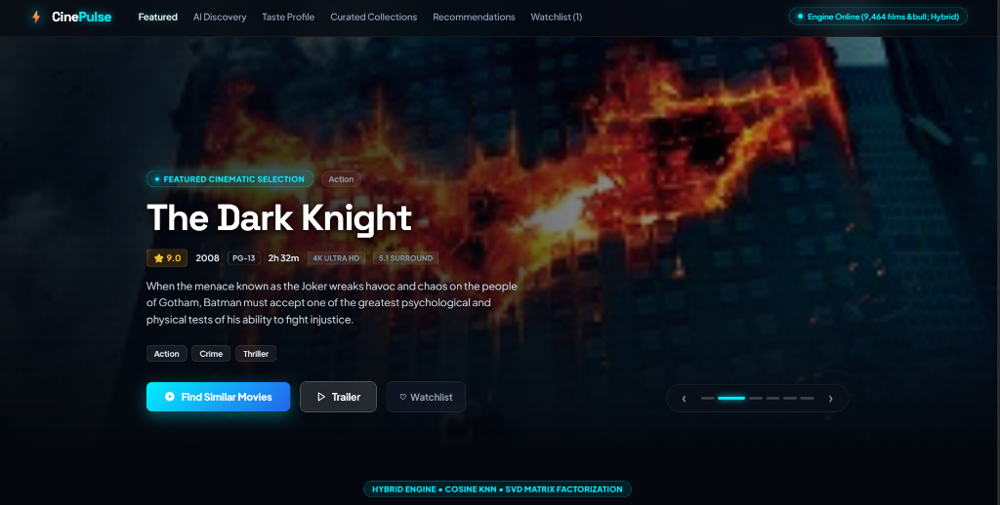
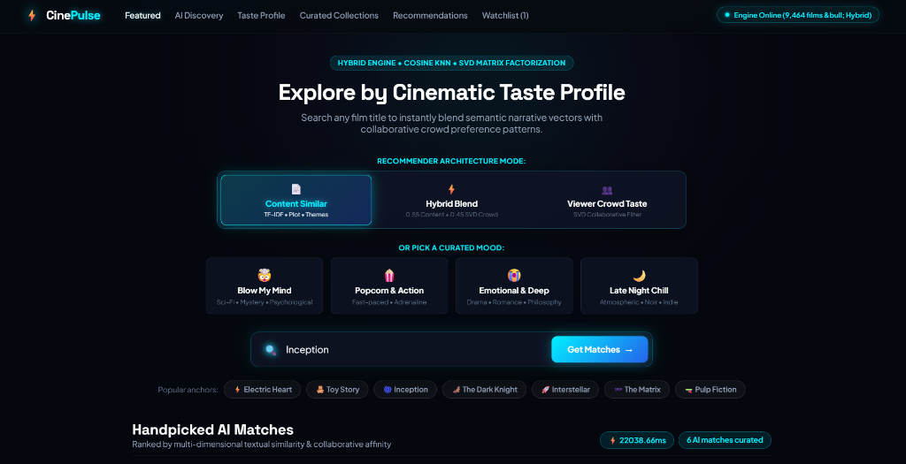
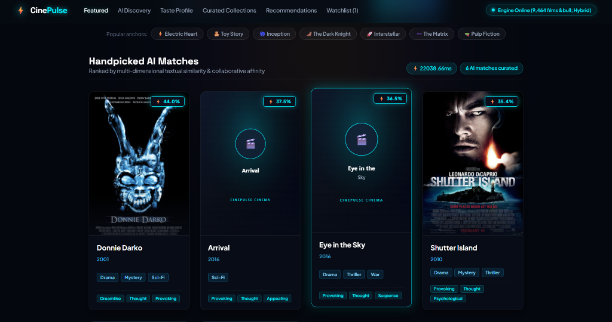
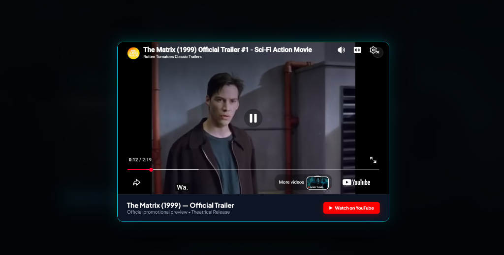

# 🎬 CinePulse — Premium Hybrid AI Movie Recommendation Engine (HCL Project)

[](https://www.python.org/)
[](https://flask.palletsprojects.com/)
[](https://scikit-learn.org/)
[](LICENSE)
[](https://github.com/Pranjal6804/HCL-Project)

An enterprise-grade, cinematic movie recommendation streaming platform featuring a **True Hybrid Recommendation Engine** (TF-IDF Content Matching + SVD Collaborative Crowd Taste), **Explainable AI (XAI)**, mood-driven discovery, dynamic 5-star live taste vectors, and a dark glassmorphic streaming UI.

---

## 📸 Product Screenshots & Visual Tour

### 1. 🎬 Cinematic Hero Section
Full-width, high-contrast hero backdrop with a smooth **2-second horizontal sliding effect**, live metadata tags, ambient lighting, and instant trailer / watchlist actions.

<p align="center">
  
</p>

---

### 2. 🎛️ Hybrid Architecture Mode & Mood Discovery
Switch seamlessly between **Content-Similar** (TF-IDF + KNN), **Hybrid Blend** ($0.55 \times \text{Content} + 0.45 \times \text{SVD}$), and **Viewer Crowd Taste** (SVD Collaborative Filtering), or explore curated mood filters (*Blow My Mind*, *Popcorn & Action*, *Emotional & Deep*, *Late Night Chill*).

<p align="center">
  
</p>

---

### 3. 🎯 Handpicked AI Matches & Thematic Tag Attribution
Smart recommendation cards displaying exact affinity match scores (e.g., 44.0%, 37.5%), genre badges, and non-zero shared TF-IDF vocabulary tags explaining why each movie was curated.

<p align="center">
  
</p>

---

### 4. 🍿 Official Theatrical Trailer Player Modal
Built-in responsive video modal with compliance headers, smooth glass backdrop, and direct YouTube integration for uninterrupted cinematic trailers.

<p align="center">
  
</p>

---

## 🌟 Key Features

### 🧠 1. Machine Learning & Hybrid AI
- **True Hybrid Recommender**:
  - **Content-Based Similarity**: TF-IDF vectorization with cosine distance matching over 9,464 movies.
  - **Collaborative Filtering**: Truncated SVD latent factor embeddings modeling real viewer rating correlations.
  - **Dynamic Blending Toggle**: Easily switch between **Content-Similar**, **Viewer Crowd Taste**, or **50/50 Hybrid Blend**.
- **Explainable AI (XAI)**:
  - Transparent feature attribution explaining *why* a film was recommended.
  - Highlights shared thematic keywords, director alignment, and genre synergy.
- **Real-Time Taste Vector Recalculation**:
  - Interactive 5-star rating system.
  - Rates 3+ movies to dynamically build your custom user taste profile in real-time.

### 🎨 2. Premium Streaming Interface
- **Cinematic Hero Carousel**: Full-width backdrops with smooth 2-second horizontal sliding animations, automatic progression, and unblurred high-contrast art.
- **Curated Horizontal Carousels**: Netflix/HBO Max-style scrollable rows (*Top Cult Classics*, *Mind-Bending Thrillers*, *Epic Sci-Fi Adventures*, *Curated Just For You*).
- **Mood Discovery Pills**: Filter recommendations by mood (*"Blow My Mind"*, *"Popcorn & Action"*, *"Emotional & Deep"*, *"Late Night Chill"*).
- **High-Resolution Poster Engine**: Wikipedia master image resolution with internal caching and dark cybernetic SVG fallbacks.

---

## 🏗️ Project Architecture

```
HCL-Project/
├── docs/
│   └── screenshots/                         # High-resolution UI screenshots
│       ├── 01_cinematic_hero.png
│       ├── 02_recommender_modes_and_moods.png
│       ├── 03_ai_recommendation_cards.png
│       └── 04_official_trailer_matrix.png
├── app.py                                   # Flask backend & Hybrid AI recommendation API
├── train_hcl_model.py                       # ML training pipeline (TF-IDF + KNN + SVD)
├── movies_10k.csv                           # 10,000+ movie metadata dataset
├── knn_model.pkl                            # Nearest Neighbors ML model
├── tfidf_matrix.pkl                         # Pre-computed TF-IDF sparse matrix
├── tfidf_vectorizer.pkl                     # Fitted TF-IDF vectorizer
├── collaborative_item_factors.pkl           # SVD collaborative latent factor vectors
├── movies_dict.pkl / movies_list.pkl        # Serialized movie metadata dictionaries
├── frontend/
│   ├── index.html                           # Streaming web app structure & modal UI
│   ├── style.css                            # Glassmorphism dark cinematic styles
│   └── script.js                            # UI controllers, API client & animations
├── hcl_movie_recommendation_system.ipynb    # ML exploratory data analysis notebook
├── Barclays_Bank_Churn_Analysis.ipynb       # Supplementary analytics research
├── generate_pdf_report.py                   # Automated senior developer report generator
└── README.md                                # Project documentation & visual guide
```

---

## 🚀 Getting Started

### 1. Prerequisites
- Python 3.9+
- pip

### 2. Installation
```bash
git clone https://github.com/Pranjal6804/HCL-Project.git
cd HCL-Project
pip install flask scikit-learn pandas numpy requests
```

### 3. Running the Application
```bash
python app.py
```
Open [http://127.0.0.1:5000](http://127.0.0.1:5000) in your web browser.

---

## 📡 API Endpoints

| Endpoint | Method | Description |
| :--- | :--- | :--- |
| `/api/health` | `GET` | Health check, active model status, and movie count |
| `/recommend` | `POST` | Get hybrid recommendations with XAI explanation scores |
| `/search` | `GET` | Real-time autocomplete search across 9,400+ titles |
| `/api/categories` | `GET` | Curated category lists for horizontal row carousels |
| `/api/mood` | `GET` | Mood-filtered recommendations |
| `/api/taste-profile` | `POST` | Generate custom recommendations from 5-star ratings |
| `/api/poster-image` | `GET` | Master-resolution Wikipedia poster proxy with caching |

---

## 👥 Authors & Acknowledgments
- **Developer**: Pranjal Tripathi ([@Pranjal6804](https://github.com/Pranjal6804))
- **Project**: HCL Movie Recommendation Project / CinePulse
